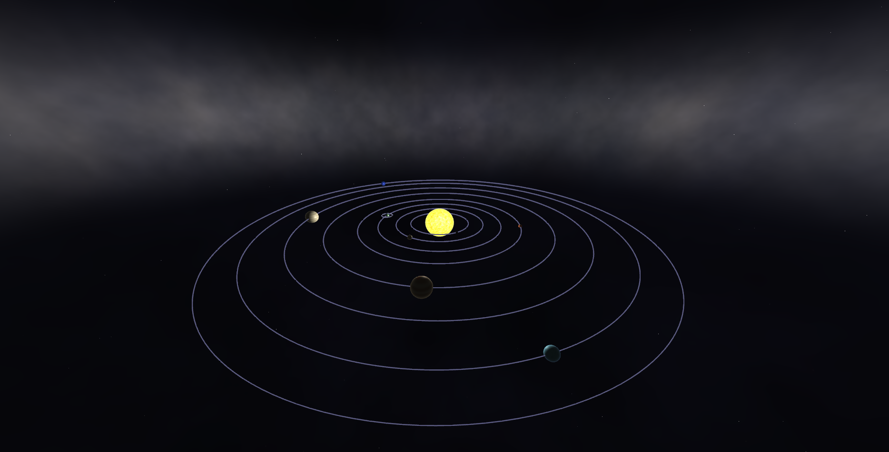

# 3D Solar System - OpenGL Project

A stunning, interactive 3D solar system simulation with realistic procedural textures and professional lighting.




## Features

### Solar System
- **Realistic Fiery Sun** - Volcanic red-orange-yellow colors with animated surface granulation, molten lava veins, solar flares, plasma bursts, and glowing corona
- **Detailed Earth** - Procedural continents, oceans, animated clouds, and polar ice caps
- **Moon** - Orbiting Earth with cratered surface
- **8 Planets** - Mercury, Venus, Mars, Jupiter, Saturn, Uranus, Neptune
- **Procedural Textures** - All planets have unique, realistic surface details

### Background & Atmosphere
- **Starfield** - Multi-layered stars with twinkling and color variation (white, blue, orange)
- **Distant Galaxy Ring** - Bright white galactic ring on the horizon providing ambient lighting
- **Subtle Nebulae** - Soft purple and blue cosmic dust clouds
- **Milky Way Band** - Gentle band across the sky

### Graphics & Performance
- **Modern OpenGL 3.3** - Shader-based rendering pipeline
- **Phong Lighting** - Realistic light interaction
- **MSAA Anti-aliasing** - Smooth edges
- **60+ FPS** - Optimized performance
- **Procedural Generation** - No texture files needed

### Controls & Interaction
- **Free Camera** - Full 6DOF movement
- **Time Control** - Pause, speed up, slow down
- **Orbit Visualization** - Toggle orbit lines
- **Dynamic Scaling** - Adjustable camera and time speeds

## Controls

### Camera Movement
| Key | Action |
|-----|--------|
| W/A/S/D | Move forward/left/backward/right |
| Space | Move up |
| Left Shift | Move down |
| Mouse | Look around |
| Mouse Scroll | Zoom in/out |

### Features
| Key | Action |
|-----|--------|
| O | Toggle orbit lines |
| P | Pause/Resume animation |
|  Arrow | Speed up time (max 10x) |
|  Arrow | Slow down time (min 0.1x) |
| +/= | Increase camera speed |
| - | Decrease camera speed |
| ESC | Exit application |

## Quick Start

### Prerequisites
- Windows 10/11 (64-bit)
- Visual Studio 2019 or later
- OpenGL 3.3+ compatible GPU

### Installation

1. **Clone or download this repository**

2. **Install dependencies via vcpkg** (Recommended):
```powershell
# Install vcpkg
git clone https://github.com/Microsoft/vcpkg.git
cd vcpkg
.\bootstrap-vcpkg.bat
.\vcpkg integrate install

# Install packages
.\vcpkg install glad:x64-windows
.\vcpkg install glfw3:x64-windows
.\vcpkg install glm:x64-windows
```
or Just run the provided `setup.bat` script.

3. **Open in Visual Studio**
   - Open `SolarSystem3D.sln`
   - Set configuration to Release (x64)
   - Press F5 to build and run

### Alternative: Manual Setup
See `PROJECT_SUMMARY.md` for detailed manual setup instructions.

## Project Structure

```
SolarSystem3D/
 include/              # Header files
    Camera.h         # First-person camera system
    Shader.h         # Shader compilation and management
    Sphere.h         # Procedural sphere generation
    Planet.h         # Planet data and orbital mechanics
    Skybox.h         # Starfield skybox geometry
 shaders/             # GLSL shader files
    planet.vs        # Planet vertex shader
    planet.fs        # Planet fragment shader (procedural textures)
    orbit.vs         # Orbit vertex shader
    orbit.fs         # Orbit fragment shader
    skybox.vs        # Skybox vertex shader
    skybox.fs        # Skybox fragment shader (starfield)
 main.cpp             # Main application and render loop
 README.md            # This file
 PROJECT_SUMMARY.md   # Complete technical documentation
 .gitignore           # Git ignore file
 copy_shaders.ps1     # Build script to copy shaders
```

## Visual Highlights

### Planet Details
- **Sun**: Fiery volcanic appearance with molten lava red, intense orange, and bright yellow colors. Features animated surface with granulation, sunspots, solar flares, plasma bursts, lava veins, and a glowing red-orange-yellow corona. Strong limb darkening with deep red edges.
- **Earth**: Blue oceans, green/brown continents, white clouds, polar ice caps, strong water reflections
- **Moon**: Gray cratered surface with mare (dark plains) and highlands
- **Mars**: Rust-red deserts with dust storms and polar ice
- **Jupiter**: Prominent bands with Great Red Spot storm system
- **Saturn**: Pale yellow with subtle atmospheric bands
- **Venus**: Thick yellowish cloud layers with swirling patterns
- **Mercury**: Heavily cratered gray rocky surface
- **Uranus**: Pale cyan-blue ice giant
- **Neptune**: Deep blue with dynamic storm systems

### Space Environment

- **Stars**: Multi-tier starfield with bright twinkling stars in various colors (white, blue, orange)
- **Distant Galaxy Ring**: Bright white galactic ring circling the horizon with realistic texture variation, providing ambient lighting to the scene
- **Milky Way**: Subtle band across the sky with detailed noise patterns
- **Nebulae**: Soft purple and blue cosmic dust clouds adding depth

## Technology Stack

- **OpenGL 3.3** - Modern graphics API
- **GLFW** - Window and input handling
- **GLM** - Mathematics library
- **GLAD** - OpenGL function loader
- **C++17** - Modern C++ features

## Key Features Implementation

### Procedural Textures
All planet textures are generated in real-time using:
- **3D Perlin Noise** - Seamless sphere mapping
- **Fractal Brownian Motion** - Multi-octave detail
- **Turbulence Functions** - Storm and chaos patterns
- **Color Gradients** - Realistic appearance

### Sun Rendering
- **Volcanic Color Palette** - Lava red, volcano red-orange, hot orange, deep orange, bright yellow
- **Surface Details** - Convection cells, granulation, sunspots, active regions
- **Dynamic Effects** - Plasma bursts, solar flares, flowing lava veins, prominences
- **Atmospheric Effects** - Limb darkening, glowing corona with red-orange-yellow gradient
- **Animation** - Pulsing effects, flowing patterns, dynamic surface movement

### Lighting Model
- **Phong Shading** - Ambient, diffuse, specular
- **Rim Lighting** - Atmospheric glow effects
- **Subsurface Scattering** - Light penetration
- **Attenuation** - Distance-based dimming

### Animation
- **Orbital Mechanics** - Realistic planet movement
- **Rotation** - Planets spin on axis
- **Moon System** - Earth's moon orbits independently
- **Twinkling Stars** - Dynamic starfield
- **Animated Surfaces** - Sun (lava flows, plasma), Earth clouds, gas giant storms
- **Rotating Galaxy Ring** - Slow rotation of distant galactic ring

## Performance

- **FPS**: 60+ on modern GPUs (GTX 1060 or better)
- **Memory**: ~50-100MB RAM
- **CPU Usage**: Low (GPU-accelerated)
- **Render Calls**: Minimal and optimized

## Customization

### Add More Celestial Bodies
```cpp
// In main.cpp
auto pluto = std::make_shared<Planet>("Pluto", 0.4f, 145.0f, 0.003f, 247.9f,
    glm::vec3(0.7f, 0.6f, 0.5f), false, 1);
planets.push_back(pluto);
```

### Adjust Visual Settings
- **Planet sizes**: Modify `size` parameter
- **Orbit speeds**: Change `orbitSpeed` value
- **Star brightness**: Edit star brightness multipliers in `skybox.fs`
- **Galaxy ring visibility**: Adjust brightness multiplier in `distantGalaxyRing()` function
- **Sun colors**: Modify color definitions in `getSunColor()` in `planet.fs`
- **Planet textures**: Modify noise functions in `planet.fs`

## Troubleshooting

**Black screen on startup:**
- Ensure graphics drivers support OpenGL 3.3+
- Check shader files are in executable directory

**Low FPS:**
- Update graphics drivers
- Reduce MSAA samples in `main.cpp`
- Lower sphere detail (change `Sphere sphere(50, 50)` to `Sphere sphere(30, 30)`)

**Shader compilation errors:**
- Check console for error messages
- Ensure all shader files (.vs, .fs) are present
- Verify file paths are correct

## Documentation

For complete technical details, see `PROJECT_SUMMARY.md` which includes:
- Detailed implementation notes
- Shader explanations
- Architecture overview
- Performance analysis
- All features documentation

## Comparison to Reference

Based on: [OpenGL-SolarSystem](https://github.com/1kar/OpenGL-SolarSystem)

**Our Enhancements:**
-  **Fiery volcanic sun** with realistic molten lava red-orange-yellow colors and dynamic surface effects
-  **Distant galaxy ring** providing ambient lighting and depth
-  Better procedural planet textures (Earth, Sun, all planets)
-  Moon orbiting Earth
-  Enhanced starfield with color variation and improved brightness
-  Subtle nebulae (purple, blue cosmic dust)
-  Milky Way band with detailed patterns
-  Better lighting (rim lighting, subsurface scattering)
-  More animation (sun lava flows, clouds, storms, twinkling, rotating galaxy)
-  Professional polish and documentation

## Contributing

This is an educational project. Feel free to:
- Use it for learning
- Modify and extend it
- Share it with others

## License

Educational use - Free to use, modify, and share.

## Credits

**Technologies:**
- OpenGL, GLFW, GLM, GLAD

**Inspiration:**
- Real solar system data
- NASA planetary information
- [OpenGL-SolarSystem](https://github.com/1kar/OpenGL-SolarSystem)

---

For technical details and implementation notes, see `PROJECT_SUMMARY.md`
